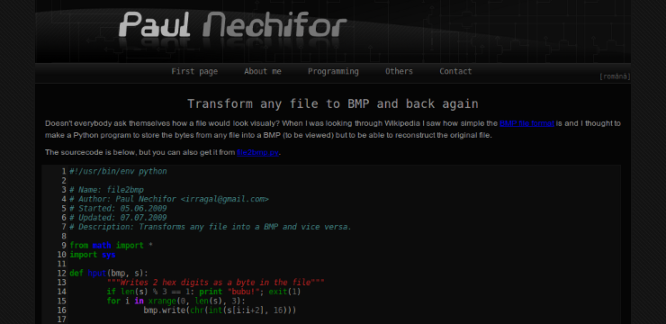

# This repository has been moved to [gitlab.com/paul-nechifor/college-website-2](http://gitlab.com/paul-nechifor/college-website-2).

Old readme:

# Second College Website

My second college website which I hosted on the students' server. This is from
2009 and it's also written in PHP. Also see [my first college
website][first-version].

## Run it

Run with:

    php -S localhost:8000

and navigate to [localhost:8000](http://localhost:8000).

## License

MIT

[first-version]: https://github.com/paul-nechifor/college-website
